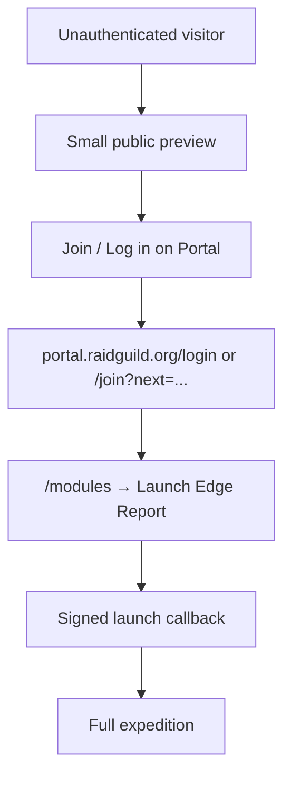
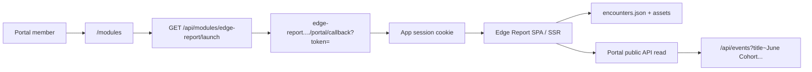

# Edge Report Module — Technical Spec

External RaidGuild Portal module: scroll-driven field research experience hosted on Railway, launched from Portal via signed module auth.

## Summary

| Field | Value |
|-------|-------|
| Working name | Edge Report |
| Module slug | `edge-report` (confirm before Portal record) |
| Hosting | Railway (standalone Next.js or Vite app) |
| Portal integration | `moduleKind: external`, `authMode: signed_launch` |
| Primary route | `/` (post-auth) or `/expedition` |
| Content source | Portal events API + curated JSON + Prism artifact URLs |

## Goals

1. Deliver the scroll narrative outlined in [outline.md](./outline.md).
2. Embed YouTube **recap** videos in encounter sections; link to **full interview** recordings.
3. Load session inventory from Portal events titled `June Cohort Fireside Chats (<guest>)`, not thread relations alone.
4. Reuse RaidGuild pixel sprites and map visual language from Portal dashboard map and `forge/arcade-roundtable-melee`.
5. Launch authenticated members from Portal `/modules` with short-lived JWT handoff.

## Non-goals (initial release)

- Writing back to Portal Payload collections
- Live Prism artifact parsing at request time (use build-time or scheduled ingest)
- Full multiplayer / realtime game mechanics
- Replacing individual blog posts or session pages
- **Gated auth redirect** — unauthenticated users are not sent to Portal login yet; full experience stays open for local dev (see [Auth & access](#auth--access))

---

## Auth & access

### Current (Phase 0–2): local-dev friendly

Keep auth **optional** until the scroll experience stabilizes.

| Mode | Behavior |
|------|----------|
| Local dev | No Portal launch required; app runs at `localhost` with full content |
| Production (interim) | Same — full expedition publicly reachable while iterating |
| Portal launch | Implement callback + session cookie when convenient, but do not block unauthenticated routes yet |

Rationale: signed-launch wiring and content/layout work can proceed in parallel without forcing a login loop during development.

### Future (Phase 4+): preview + Portal handoff

Target pattern aligned with Portal external modules:



| Surface | Unauthenticated | Authenticated (via Portal launch) |
|---------|---------------|-----------------------------------|
| Act 0 trailhead | Yes — headline, framing, stats | Yes |
| Sample encounter | Yes — one pilot NPC, no embed or recap-only | — |
| Full walk (13 NPCs) | No | Yes |
| Analysis camp + charts | No | Yes |
| Research ledger | Partial — outbound Portal/wiki links only | Yes |

**Redirect behavior (future):**

- Unauthenticated user hits `/` or `/expedition` → render preview route (not a hard 401).
- Preview ends with CTA → `PORTAL_URL/login?next=/modules` or `/join` (exact `next` path TBD when module card is live).
- Return path: member launches from `/modules` → signed JWT → app session → full content.

**Implementation note:** use an env flag e.g. `EDGE_REPORT_REQUIRE_AUTH=false` (default) so production can flip gating on without code changes.

Do **not** implement preview gating or Portal redirects until explicitly scheduled (listed in Phase 4 below).

---

## Data & persistence

**Prefer Portal as the system of record.** The Edge Report app should not duplicate CMS state unless there is a clear local-only need.

| Data | Source | Local storage |
|------|--------|---------------|
| Session list, resources, media URLs | Portal `/api/events` (public read) | `content/encounters.json` — build-time snapshot |
| Curated highlights, hooks, NPC mapping | Hand-edited in repo | `content/encounters.json` |
| Cross-session themes / chart aggregates | Derived from `encounters.json` tags + editorial lens map | `src/lib/analysisCamp.ts` (runtime); optional `content/analysis-curated.json` in slice 2 |
| Prism artifacts (summary, briefs) | Outbound links or build-time fetch | Optional cache in JSON; no DB required |
| Launch session (user id, profile, roles) | Portal JWT callback | Encrypted cookie (`iron-session`) — no DB |
| User preferences (character choice, scroll position) | — | `localStorage` first |

### Database: avoid until necessary

**No database for MVP.** Portal API + static JSON files are sufficient for content and ingest.

If a DB becomes useful later (e.g. analytics, ingest job watermark, admin curation UI):

- Use **SQLite** (file-backed, Railway volume or ephemeral with rebuild-from-Portal)
- ORM: Drizzle or better-sqlite3 — keep schema minimal
- Still treat Portal as canonical; SQLite is cache/job state only, not a second CMS

Do not introduce Postgres or a standalone content DB unless a future feature cannot be served from Portal + JSON.

---

## Architecture



### Recommended stack

| Layer | Choice | Notes |
|-------|--------|-------|
| Framework | Next.js 15 App Router | Matches Portal + arcade repos; easy Railway deploy |
| Styling | Tailwind + CSS scroll-driven animations | Parallax via `transform` + `scroll-timeline` or JS fallback |
| Auth | `jose` or `jsonwebtoken` | Mirror Portal external module guide |
| Session | `iron-session` or encrypted cookies | Only after launch callback; optional in local dev |
| Data | Portal API + `content/*.json` | SQLite deferred |
| Charts (Phase 2) | Recharts or lightweight D3 | Static curated datasets first |
| Deploy | Railway Dockerfile or Nixpacks | `PORT` from env |

---

## Portal module registration

Create a `modules` record in Payload (see [external-module-integration-guide.md](../../2026-06-26-30213538/docs/external-module-integration-guide.md)):

```txt
name: Edge Report
slug: edge-report
summary: Long-form scroll research experience from June cohort fireside interviews.
status: prototype
moduleKind: external
authMode: signed_launch
externalCallbackURL: https://<edge-report-service>.up.railway.app/portal/callback
launchSecretEnvKey: EDGE_REPORT_LAUNCH_SECRET
launchAudience: edge-report
launchTokenTTLSeconds: 120
visibility: authenticated
enabled: true
entryRoute: (optional marketing URL on module card)
relatedThreads: [how-to-raidguild-field-experience-from-the-edge]
corePrimitiveRelationships: [event, post, thread]
```

Shared secret must exist in **both** environments:

```txt
EDGE_REPORT_LAUNCH_SECRET=<long-random-shared-secret>
PORTAL_URL=https://portal.raidguild.org
```

### Launch callback handler

1. Receive `GET /portal/callback?token=<jwt>`
2. Verify signature, `typ`, `iss`, `aud`, `exp`, `moduleSlug`
3. Reject unverified email if module uses `includeEmailInLaunch`
4. Create app-local session (user id, profile id, roles, display name)
5. Redirect to `/` or `/expedition`

**Now:** callback handler can be stubbed or skipped; unauthenticated routes serve the full app for local dev.

**Later:** unauthenticated visitors see [preview + Portal redirect](#auth--access) only when `EDGE_REPORT_REQUIRE_AUTH=true`.

---

## Session data ingestion

### Canonical query

```http
GET https://portal.raidguild.org/api/events
  ?where[title][contains]=June Cohort Fireside Chats
  &sort=startsAt
  &limit=20
  &depth=0
```

Filter client-side to exact title pattern if needed:

```ts
/^June Cohort Fireside Chats \((.+)\)$/
```

### Video URL normalization

Portal event `resources` labels vary. Map into two fields:

```ts
type SessionMedia = {
  recapYouTubeId: string | null      // embed
  fullInterviewURL: string | null    // outbound link
  fallbackRecapMP4: string | null    // remotion only
  discordRecordingURL: string | null // last resort full link
}
```

**Classification rules** (first match wins per category):

| Field | Match resource label (case-insensitive) | Or |
|-------|----------------------------------------|-----|
| `recapYouTubeId` | `recap`, `highlight`, `recap clip`, `recap video` | — |
| `fullInterviewURL` | `full interview`, `meeting recording`, `session recording`, `recording` (YouTube only) | `recordingURL` if YouTube |
| `fallbackRecapMP4` | remotion `*.mp4` in resources | — |
| `discordRecordingURL` | discord-adapter recording URL | `recordingURL` if not YouTube |

**UI rules:**

- If `recapYouTubeId` → render `<iframe>` (youtube-nocookie embed)
- Always show `Watch full interview` when `fullInterviewURL` present
- If no recap but `fallbackRecapMP4` → optional `<video>` with poster
- If only discord recording → link only, no embed
- Never embed full 30-minute interview by default (bandwidth + narrative pacing)

### Encounter content file

Curated bundle at `content/encounters.json` (generated + hand-edited):

```ts
type Encounter = {
  eventId: number
  guestName: string
  slug: string
  startsAt: string
  npcArchetype: string
  spriteSlug: string
  hook: string
  highlights: Array<{
    text: string
    source: 'summary' | 'transcript' | 'highlight-plan' | 'post'
    sourceURL?: string
    verifiedQuote?: boolean
  }>
  tags: string[]
  media: SessionMedia
  links: {
    eventURL: string
    posts: Array<{ title: string; url: string }>
    summaryArtifactURL?: string
    angleBriefURL?: string
    topicMapURL?: string
  }
}
```

Build script `scripts/sync-portal-sessions.mjs`:

1. Fetch all cohort events
2. Normalize media URLs
3. Merge with hand-curated highlights (or future Prism ingest)
4. Write `content/encounters.json`
5. Fail CI if event count drops below 13 without explicit override

---

## UI specification

### Layout

| Region | Behavior |
|--------|----------|
| Top path (sticky) | Raider sprite; horizontal position = scroll progress through Act 1 |
| Main column | NPC encounters, analysis, ledger |
| Side trail map (Phase 2) | Fixed minimap with 13 stops |
| Footer | Portal / RaidGuild links |

### Scroll / parallax

- **MVP:** `scrollY` → raider `translateX` along fixed path width
- **Beta:** 2–3 background layers at different scroll multipliers (map background webp)
- **A11y:** `prefers-reduced-motion` disables parallax; raider jumps per section

### NPC encounter component

```txt
<EncounterSection>
  <NPCSprite role={spriteSlug} />
  <DialogPanel>
    <hook />
    <HighlightCards />
  </DialogPanel>
  <YouTubeRecapEmbed videoId={recapYouTubeId} />
  <SessionLinks fullInterview post event artifacts />
</EncounterSection>
```

### YouTube embed

- Use `https://www.youtube-nocookie.com/embed/{id}`
- Lazy-load iframe on intersection
- 16:9 responsive wrapper
- `title` attr: `{guest} fireside recap`

---

## Assets

Copy or submodule sprites from:

- Portal: `public/assets/map/sprites/characters/*`
- Arcade: `public/sprites/characters/*`, `public/backgrounds/arena-dungeon.png`

Track license/provenance in `assets/ATTRIBUTION.md`. Prefer one canonical sprite sheet per archetype (Portal map sheets are already wired to `MapSprite` frame layout: 54×68, 10 frames).

---

## Environment variables

```txt
# Auth
EDGE_REPORT_LAUNCH_SECRET=
PORTAL_URL=https://portal.raidguild.org
SESSION_SECRET=

# Optional ingest
PORTAL_EMAIL=
PORTAL_PASSWORD=

# App
NODE_ENV=production
PORT=3000
NEXT_PUBLIC_PORTAL_URL=https://portal.raidguild.org

# Auth gating (future — default off for local dev)
EDGE_REPORT_REQUIRE_AUTH=false
```

---

## Railway deployment

1. Connect GitHub repo to Railway project
2. Set env vars (including shared launch secret with Portal production)
3. Build: `pnpm build` / `npm run build`
4. Start: `pnpm start` / `node server` per framework
5. Register public URL as `externalCallbackURL` in Portal module record
6. Smoke test: Portal → Launch app → callback → expedition renders

### Health check

`GET /health` → `{ ok: true }` for Railway probe.

---

## Security

- Verify JWT on every callback; single-use session establishment
- HTTP-only, secure, same-site cookies for app session
- No long-lived Portal tokens stored
- Sanitize outbound links (`https:` only)
- CSP: allow `youtube-nocookie.com` for embeds
- Do not expose Prism internal URLs in public builds if they require auth

---

## Testing

| Test | Type |
|------|------|
| JWT verification (valid / expired / wrong aud) | unit |
| YouTube URL classifier | unit |
| 13 events ingested | integration (CI) |
| Launch flow mock | integration |
| Encounter section renders embed + full link | e2e |
| Reduced motion path | e2e |

---

## Build phases

### Phase 0 — Docs + repo (current)

- [x] `docs/outline.md`
- [x] `docs/spec.md`
- [ ] Portal module record (staging)
- [ ] `scripts/sync-portal-sessions.mjs`

### Phase 1 — MVP shell

- Next.js app on Railway
- Act 0 trailhead + 3 pilot encounters
- YouTube recap embed + full interview links
- Raider scroll on path
- No auth gate (`EDGE_REPORT_REQUIRE_AUTH=false`)
- Optional: signed launch callback stub (not required for dev)

### Phase 2 — Full corpus

- All 13 encounters from `encounters.json`
- Sync script in CI
- Act 2 essay (static MDX)
- Trail minimap

### Phase 3 — Analysis

**Slice 1–2 (shipped):** stat cards, theme frequency, guest lens, tool mentions, concern/leverage, output funnel, publication lag — see [analysis-camp.md](./analysis-camp.md).

**Remaining:**

- Portal ingest for wiki candidates and verified quotes (slice 3)
- External context comparison cards (slice 4)
- Quote wall (verified only)
- Research ledger wiki links

### Phase 4 — Auth, preview & polish

- Public preview route (Act 0 + sample encounter)
- Portal login/join redirect for full expedition (`EDGE_REPORT_REQUIRE_AUTH=true`)
- Signed launch callback + session cookie (production path)
- Parallax layers + NPC dialog animations

---

## Open decisions

| Question | Default recommendation |
|----------|------------------------|
| Auth gating | **Deferred** — full app open until Phase 4; `EDGE_REPORT_REQUIRE_AUTH=false` |
| Public preview vs members-only | Future: small preview unauthenticated; full report after Portal launch |
| Database | **None for MVP**; SQLite only if ingest/cache needs it; Portal API remains canonical |
| Slug | `edge-report` |
| Include email in launch | `true` (Portal default) when launch is enabled |
| Live Portal fetch vs static JSON | Static JSON at build; weekly sync job |
| Sara Brown / Victor media gaps | Ship with placeholder; sync script alerts when URLs appear |

---

## References

- [Analysis Camp — data & charts](./analysis-camp.md)
- [Content outline](./outline.md)
- [Portal external module guide](../../2026-06-26-30213538/docs/external-module-integration-guide.md)
- [Cohort thread](https://portal.raidguild.org/threads/how-to-raidguild-field-experience-from-the-edge)
- [Portal events](https://portal.raidguild.org/events)
- Dashboard map implementation: `2026-06-26-30213538/src/app/(frontend)/dashboard/map/`
- Arcade sprites: `forge/arcade-roundtable-melee/public/sprites/`